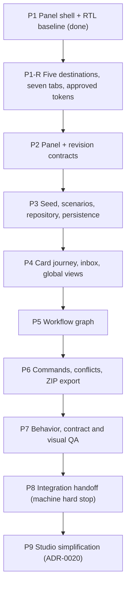

# Ticket Index — Panel-First Plan (P-series)

> **v1 is frozen.** The P-series below is delivered and merged to `main` at `646efd7`, and
> `main` takes no more work. New work happens on the `v2` branch, cloned from that commit with
> its full history. See CLAUDE.md, "Branches".

## Scope note

The build is **panel-first** per the authoritative scope correction
`docs/implementation/18_SCOPE_CORRECTION_PANEL_FIRST_AND_MOCK_MACHINES.md` ("doc 18"), adopted
by ADR-0017. This delivery builds the operational panel and its minimum supporting backend
only; Machines 01–05, their runtime and their infrastructure are a separate build that
connects later through the `MachineGateway` adapter (18 §1–2, §9).

- **The P-series is the active plan**, now scoped by the owner's V2 pack (`docs/frontend-v2/`,
  adopted by ADR-0019). It implements the (18 §11) build sequence against the (18 §12)
  acceptance criteria **extended by the V2 journeys A01–A20**, and the fourteen (18 §7.2) mock
  scenarios **extended to twenty-four** (S01–S14 are the recorded fourteen, 1:1 and in order;
  S15–S24 are additive per ADR-0019 D15).
- **Frontend only** (ADR-0019 D2): doc 18 §4.2's permission for mock API routes and a local mock
  server is withdrawn. Demo state persists in one versioned browser key `drop-panel-demo-v2`.
- **The 0-series is partitioned** (ADR-0017 D2): **0.1 is DONE** and committed — nothing here
  reopens it; its thirteen scaffold packages stay frozen inert placeholders (ADR-0017 D3).
  The remaining 0-series tickets are **deferred** (machine-side) or **superseded** into the
  P-series; each file carries a status banner naming ADR-0017. Nothing is deleted — the
  ticket files remain the recorded contract the machine build inherits.
- Three panel packages join the workspace per (18 §10): `panel-domain`, `machine-gateway`,
  `mock-data` (ADR-0017 D3).
- The ADR-0012 state vocabulary and ADR-0014 event taxonomy are the presentation vocabulary
  of the mocks; ADR-0013 approval semantics (N distinct human approvers, single approval
  write path) are what the panel presents (ADR-0017 D4). No PostgreSQL, Redis, queues or AI
  providers anywhere in panel scope (18 §4.2, §5; ADR-0017 D5).

File format is unchanged: `docs/tickets/<id>-<slug>.md` with the mandatory YAML block from
(15 §9), followed by **What to build**, **Blocked by** and **Acceptance criteria**.

## Active tickets (P-series)

Scopes below are the **V2 mapping** (`docs/frontend-v2/04_MOCKS_AND_ACCEPTANCE.md` §3), adopted
by ADR-0019. P1 is **reopened as P1-R** by ADR-0019 D13 for the navigation collapse, the seven
project tabs and the approved brand tokens; Ticket 0.1 stays untouchable.

| ID | Title | Depends on | Status |
|---|---|---|---|
| P1 | Panel shell and FA-first RTL baseline (owned shadcn/ui, tokens, fonts, `/studio` shell) | 0.1 (done) | **done** — superseded in part by P1-R |
| P1-R | Five-destination shell, seven project tabs, approved tokens, RTL and responsive primitives | P1 — frontier | **done** |
| P2 | Preserve `MachineGateway`; panel/revision contracts, version-linked review and calendar/package DTOs | P1-R | **done** |
| P3 | Deterministic seed, scenario recipes, shared repository, persistence and command behavior | P2 | **done** |
| P4 | Full start → concept → content → package → calendar card journey, inbox and global views | P3 | **done** |
| P5 | Synchronized graph with branches, localized loops, inspectors and definition inspection | P4 | **done** |
| P6 | Functional commands, version conflicts, errors, stale dependencies, downloadable mock ZIP | P5 | **done** |
| P7 | Behavior/contract checks plus responsive, RTL, keyboard and visual QA | P6 | **done** |
| P8 | Future integration mapping, unresolved contracts and frontend handoff; stop before machine work | P7 | **done** |
| P9 | Studio simplification: navigation by work unit, the Engine surface, the calendar, and the interface-language guard | P8 | **done** |

All P-tickets are **delivered**. The frontend handoff is
`docs/handoff/P8-frontend-to-machine-build.md`, whose navigation and surface sections are
superseded by `docs/handoff/P9-studio-simplification.md`; its open decisions, provisional
contracts and connection points stand unchanged. Machine work does not begin automatically
(ADR-0019 D20).

**P9 is not a reopening of the hard stop.** P8 stops **machine** work, and that stop holds:
nothing in P9 starts a machine, a transport or a backend. ADR-0020 D1 reopens the panel's
own presentation on the owner's simplification brief, which is panel scope, and P9 is that
work.

**Exactly one frontier** (ADR-0018 D2, ADR-0019 D20 — sequential execution). The order is
**P1-R → P2 → P3 → P4 → P5 → P6 → P7 → P8 → P9**; each ticket starts only when its
predecessor completes with green checks. P5's earlier `dependencies: ["P1","P2","P3"]` is
corrected to include P4 (ADR-0019 D20).

## Dependency graph

Blocking edges only, as declared in each ticket's **Blocked by** section. P2→P4 and P2→P5 are
drawn even though P3 covers them transitively, because P4/P5 consume P2's frozen DTOs
directly.

## Deferred / superseded 0-series tickets

Statuses below are the banners carried in each file (ADR-0017 D2). Deferred tickets are
machine-side scope: not implemented in this delivery, inherited by the separate machine build.

| ID | Title | Banner status | Reason (one line) |
|---|---|---|---|
| 0.2 | Compose reference stack | DEFERRED (ADR-0017) | Postgres/Redis/MinIO/worker infrastructure exists only for the machine runtime (18 §4.2, §5) |
| 0.3 | Zod contracts v1 | PARTIALLY SUPERSEDED (ADR-0017) | Panel-facing DTO slice ships as P2; the full machine contract set is machine-side |
| 0.4 | Drizzle schemas and migrations | DEFERRED (ADR-0017) | Authoritative PostgreSQL persistence is owned by the machine system (18 §5) |
| 0.5 | Better Auth invitations and sessions | DEFERRED (ADR-0017) | Full auth backend is machine-side; the panel keeps only the session scaffolding (18 §4.2) it demonstrably needs |
| 0.6 | RBAC, approvals and audit | DEFERRED (ADR-0017) | Server engine half deferred; panel-side RBAC checks survive inside P-series tickets, ADR-0013 semantics presented via mocks |
| 0.7 | Artifact and run registries | DEFERRED (ADR-0017) | Registry persistence belongs to the machine build; the panel shows mocked artifacts/runs |
| 0.8 | Prompt, Rule and Example registries | DEFERRED (ADR-0017) | Generation-governing registries are machine scope; no prompts in the panel build (18 §5) |
| 0.9 | AI gateway and mock adapter | DEFERRED (ADR-0017) | Provider gateways are machine execution; the panel never calls AI providers (18 §5) |
| 0.10 | Pipeline runtime | DEFERRED (ADR-0017) | The runtime is the machine orchestrator itself — the core of what doc 18 defers (18 §2) |
| 0.11 | Run manifests and comparisons | DEFERRED (ADR-0017) | Manifests require real runs; comparison views appear over mocked runs in P4 |
| 0.12 | FA-first RTL UI foundation | SUPERSEDED BY P1 (ADR-0017) | Substance carried into P1 under panel scope; file remains the machine-era reference |
| 0.13 | Dashboard skeleton | SUPERSEDED BY P4/P5 (ADR-0017) | Dashboard surfaces ship as P4 and graph surfaces as P5, on mock data |
| 0.14 | S3-compatible storage | DEFERRED (ADR-0017) | Object storage is machine infrastructure; not added for future machine needs (18 §4.2) |
| 0.15 | Release 0 audit sweep | DEFERRED (ADR-0017) | Audits machine-era exit criteria; UI-visible criteria are carried by the mock scenarios instead |
| 0.16 | Workflow/run/SSE/approval APIs | DEFERRED (ADR-0017) | The API band becomes the provisional (18 §9) integration surface documented in P8 |

## Frontier rule and the P8 hard stop

Work any ticket whose blockers are all done, **one ticket per session** (00 §5.1). After the
done 0.1, **P1 opens alone and the P-series runs strictly one ticket at a time**
(ADR-0018 D2): P1 → P2 → P3, then P4 and P5 in ticket order, then P6 → P7 → P8. Freeze the P2
contracts before P3/P4/P5 open, and never parallelize edits to `panel-domain` schemas, the
`MachineGateway` interface, or approval/audit presentation semantics (15 §11, applied to the
panel seams). Every ticket ends with green checks, independent review, a commit citing the
ticket ID and a structured handoff (16 §9) before its dependents may start.

**P8 is a hard stop** (18 §11): "Do not start machine implementation after step 8. Stop and
hand off the completed panel for review." After P8, the panel is handed to the human owner;
no machine work, no provider integration, no further tickets begin in this repository under
this scope. Machine-side work resumes only in the separate machine build, connecting through
`RealMachineGateway` (18 §9).

P9 is not an exception to that stop — it is panel presentation on the owner's own brief
(ADR-0020 D1). **The stop itself was put to the owner on 2026-09-10 and upheld**: no machine
work, and not even the infrastructure beneath it. See `docs/handoff/P8-frontend-to-machine-build.md`
§8.
