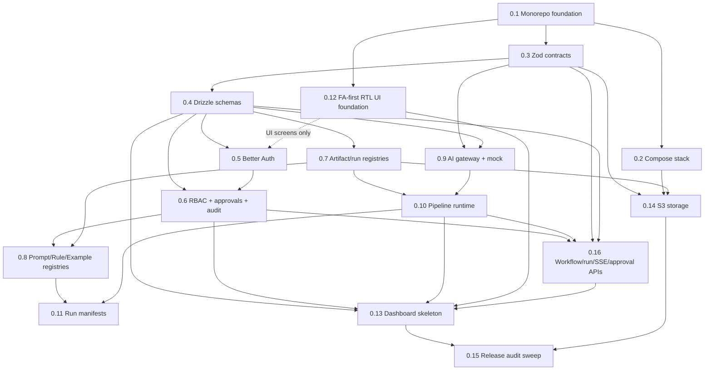

# Release 0 Ticket Index

This directory holds the per-ticket specification files mandated by the ticket template of
(15 §9) and required reading for every build session after 0.1 (16 §4). Each file derives from
the implementation bundle and the repair ADRs; no ticket file overrides the bundle silently —
where a ticket applies a repair, it cites the ADR that records it (ADR-0011 through ADR-0016).

File format: `docs/tickets/<id>-<slug>.md`, starting with the mandatory YAML block from
(15 §9), followed by **What to build**, **Blocked by** and **Acceptance criteria**.

> **Note on ticket 0.16.** Ticket 0.16 was added by **ADR-0014** to own the workflow
> definition/validate/publish engine, run command endpoints, SSE stream and approval
> request/decision endpoints — the API band the Release 0 vertical demo requires but no ticket
> previously owned. Per the amendment rule of (15 §1), the authoritative 0.1–0.15 plan is
> **not renumbered**; 0.16 is appended.

## Ticket table

| ID | Title | Depends on | Status |
|---|---|---|---|
| 0.1 | Monorepo foundation (pnpm, strict TS, scaffolds, Vitest) | None — sole start | ready |
| 0.2 | Compose reference stack (Postgres, Redis, MinIO, web, worker, Nginx) | 0.1 | ready |
| 0.3 | Zod contracts v1 | 0.1 | ready |
| 0.4 | Drizzle schemas and migrations | 0.3 | ready |
| 0.5 | Better Auth invitations and sessions | 0.4 (UI screens also 0.12, per ADR-0014; server-side auth is unblocked) | ready |
| 0.6 | Actors, roles, capabilities, approval policies and audit | 0.4, 0.5 | ready |
| 0.7 | Artifact and run registries | 0.4 | ready |
| 0.8 | Prompt, Rule and Example registries | 0.6, 0.7 | ready |
| 0.9 | AI gateway and mock adapter | 0.3, 0.4 | ready |
| 0.10 | Pipeline runtime | 0.7, 0.9 | ready |
| 0.11 | Run manifests and comparisons | 0.10, 0.8 (0.8 added by ADR-0014) | ready |
| 0.12 | FA-first RTL UI foundation | 0.1 | ready |
| 0.13 | Dashboard skeleton | 0.4, 0.6, 0.10, 0.12, 0.16 (0.4/0.10/0.16 added by ADR-0014) | ready |
| 0.14 | S3-compatible storage | 0.2, 0.3, 0.7 | ready |
| 0.15 | Release 0 audit sweep | all (0.1–0.14, 0.16) | ready |
| 0.16 | Workflow definition, run-command, SSE and approval APIs | 0.3, 0.4, 0.6, 0.10 (ADR-0014 D4) | ready |

Dependency corrections relative to the (15 §2) table are recorded in ADR-0014 (0.13 gains
0.4, 0.10, 0.16; 0.11 gains 0.8; 0.5's UI screens depend on 0.12).

## Dependency graph

Blocking edges only. The dashed edge is the partial dependency of 0.5's UI screens on 0.12;
0.5's server-side work does not wait for it. 0.15 formally depends on **all** tickets; since
0.13 and 0.14 are the only tickets nothing else depends on, the two drawn edges cover the full
set transitively.

## Frontier rule

Work any ticket whose blockers are all done. **0.1 is the sole start.** After 0.1 completes,
0.2, 0.3 and 0.12 open; the frontier then advances edge by edge. Build only one approved ticket
per session (00 §5.1), freeze contracts before opening parallel lanes (00 §5.2), and never
parallelize edits to the same migration/schema, `packages/contracts`, approval/audit semantics
or published workflow version logic (15 §11). Every ticket ends with green checks, independent
review, a commit and a structured handoff (16 §7) before its dependents may start.
