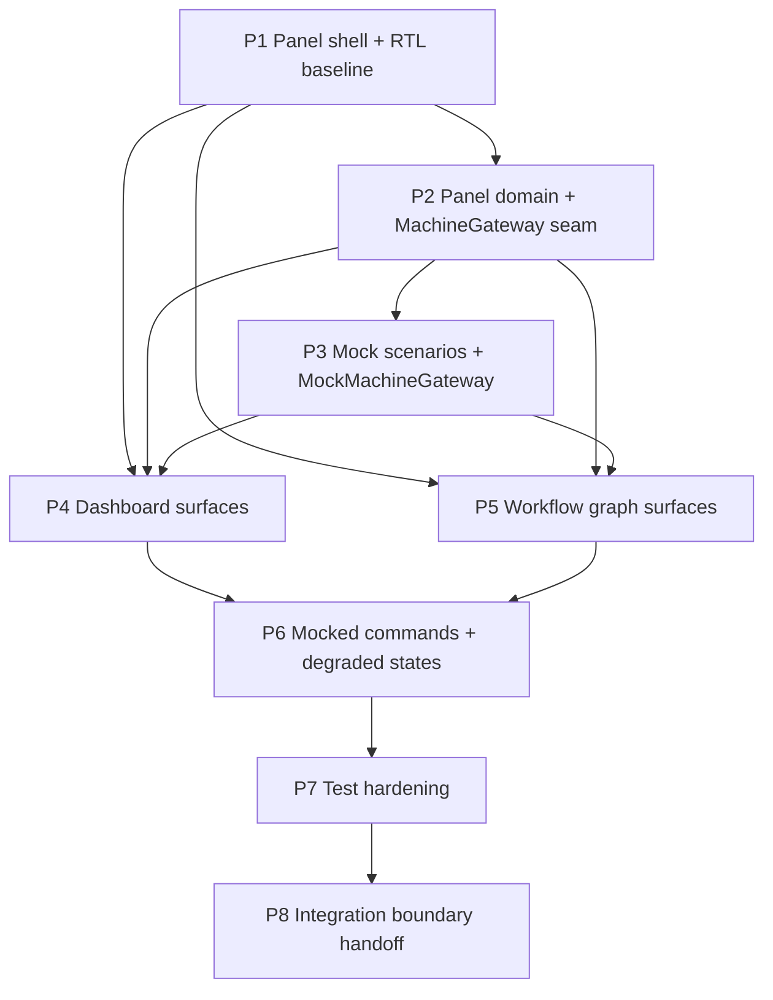

# Ticket Index — Panel-First Plan (P-series)

## Scope note

The build is **panel-first** per the authoritative scope correction
`docs/implementation/18_SCOPE_CORRECTION_PANEL_FIRST_AND_MOCK_MACHINES.md` ("doc 18"), adopted
by ADR-0017. This delivery builds the operational panel and its minimum supporting backend
only; Machines 01–05, their runtime and their infrastructure are a separate build that
connects later through the `MachineGateway` adapter (18 §1–2, §9).

- **The P-series (P1–P8) is the active plan.** It implements the (18 §11) build sequence
  against the (18 §12) acceptance criteria and the fourteen (18 §7.2) mock scenarios.
- **The 0-series is partitioned** (ADR-0017 D2): **0.1 is DONE** and committed — nothing here
  reopens it; its thirteen scaffold packages stay frozen inert placeholders (ADR-0017 D3).
  The remaining 0-series tickets are **deferred** (machine-side) or **superseded** into the
  P-series; each file carries a status banner naming ADR-0017. Nothing is deleted — the
  ticket files remain the recorded contract the machine build inherits.
- Three panel packages join the workspace per (18 §10): `panel-domain`, `machine-gateway`,
  `mock-data` (ADR-0017 D3).
- The ADR-0012 state vocabulary and ADR-0014 event taxonomy are the presentation vocabulary
  of the mocks; ADR-0013 approval semantics (N distinct human approvers, single approval
  write path) are what the panel presents (ADR-0017 D4). No PostgreSQL, Redis, queues or AI
  providers anywhere in panel scope (18 §4.2, §5; ADR-0017 D5).

File format is unchanged: `docs/tickets/<id>-<slug>.md` with the mandatory YAML block from
(15 §9), followed by **What to build**, **Blocked by** and **Acceptance criteria**.

## Active tickets (P-series)

| ID | Title | Depends on | Status |
|---|---|---|---|
| P1 | Panel shell and FA-first RTL baseline (owned shadcn/ui, tokens, fonts, `/studio` shell) | 0.1 (done) — frontier | ready |
| P2 | Panel domain contracts, `MachineGateway` + `PanelGateway` seams (`panel-domain`, `machine-gateway`) | P1 (ADR-0018 D2) | ready |
| P3 | Deterministic mock scenarios and `MockMachineGateway` (`mock-data`, fourteen 18 §7.2 scenarios) | P2 | ready |
| P4 | Dashboard surfaces on mock data (overview, Programs, Lenses, approvals, artifacts, requests, audit) | P1, P2, P3 | ready |
| P5 | Workflow graph surfaces (React Flow definition and run-inspection views on mock data) | P1, P2, P3 | ready |
| P6 | Mocked commands and degraded states (run controls, approvals, synchronize, audit visibility) | P4, P5 | ready |
| P7 | Test hardening (component, adapter-contract, scenario, accessibility, visual, FA/RTL e2e) | P6 | ready |
| P8 | Integration boundary handoff (`RealMachineGateway` connection points, provisional contracts) | P7 | ready |

**P1 is the sole frontier** (ADR-0018 D2 — sequential execution): P2 starts only after P1 completes
(their packages do not overlap). P3 and P4 must not start before the P2 contract freeze lands
(doc 15 §11 discipline applies unchanged to the P-series).

## Dependency graph

Blocking edges only, as declared in each ticket's **Blocked by** section. P2→P4 and P2→P5 are
drawn even though P3 covers them transitively, because P4/P5 consume P2's frozen DTOs
directly.

## Deferred / superseded 0-series tickets

Statuses below are the banners carried in each file (ADR-0017 D2). Deferred tickets are
machine-side scope: not implemented in this delivery, inherited by the separate machine build.

| ID | Title | Banner status | Reason (one line) |
|---|---|---|---|
| 0.2 | Compose reference stack | DEFERRED (ADR-0017) | Postgres/Redis/MinIO/worker infrastructure exists only for the machine runtime (18 §4.2, §5) |
| 0.3 | Zod contracts v1 | PARTIALLY SUPERSEDED (ADR-0017) | Panel-facing DTO slice ships as P2; the full machine contract set is machine-side |
| 0.4 | Drizzle schemas and migrations | DEFERRED (ADR-0017) | Authoritative PostgreSQL persistence is owned by the machine system (18 §5) |
| 0.5 | Better Auth invitations and sessions | DEFERRED (ADR-0017) | Full auth backend is machine-side; the panel keeps only the session scaffolding (18 §4.2) it demonstrably needs |
| 0.6 | RBAC, approvals and audit | DEFERRED (ADR-0017) | Server engine half deferred; panel-side RBAC checks survive inside P-series tickets, ADR-0013 semantics presented via mocks |
| 0.7 | Artifact and run registries | DEFERRED (ADR-0017) | Registry persistence belongs to the machine build; the panel shows mocked artifacts/runs |
| 0.8 | Prompt, Rule and Example registries | DEFERRED (ADR-0017) | Generation-governing registries are machine scope; no prompts in the panel build (18 §5) |
| 0.9 | AI gateway and mock adapter | DEFERRED (ADR-0017) | Provider gateways are machine execution; the panel never calls AI providers (18 §5) |
| 0.10 | Pipeline runtime | DEFERRED (ADR-0017) | The runtime is the machine orchestrator itself — the core of what doc 18 defers (18 §2) |
| 0.11 | Run manifests and comparisons | DEFERRED (ADR-0017) | Manifests require real runs; comparison views appear over mocked runs in P4 |
| 0.12 | FA-first RTL UI foundation | SUPERSEDED BY P1 (ADR-0017) | Substance carried into P1 under panel scope; file remains the machine-era reference |
| 0.13 | Dashboard skeleton | SUPERSEDED BY P4/P5 (ADR-0017) | Dashboard surfaces ship as P4 and graph surfaces as P5, on mock data |
| 0.14 | S3-compatible storage | DEFERRED (ADR-0017) | Object storage is machine infrastructure; not added for future machine needs (18 §4.2) |
| 0.15 | Release 0 audit sweep | DEFERRED (ADR-0017) | Audits machine-era exit criteria; UI-visible criteria are carried by the mock scenarios instead |
| 0.16 | Workflow/run/SSE/approval APIs | DEFERRED (ADR-0017) | The API band becomes the provisional (18 §9) integration surface documented in P8 |

## Frontier rule and the P8 hard stop

Work any ticket whose blockers are all done, **one ticket per session** (00 §5.1). After the
done 0.1, **P1 opens alone and the P-series runs strictly one ticket at a time**
(ADR-0018 D2): P1 → P2 → P3, then P4 and P5 in ticket order, then P6 → P7 → P8. Freeze the P2
contracts before P3/P4/P5 open, and never parallelize edits to `panel-domain` schemas, the
`MachineGateway` interface, or approval/audit presentation semantics (15 §11, applied to the
panel seams). Every ticket ends with green checks, independent review, a commit citing the
ticket ID and a structured handoff (16 §9) before its dependents may start.

**P8 is a hard stop** (18 §11): "Do not start machine implementation after step 8. Stop and
hand off the completed panel for review." After P8, the panel is handed to the human owner;
no machine work, no provider integration, no further tickets begin in this repository under
this scope. Machine-side work resumes only in the separate machine build, connecting through
`RealMachineGateway` (18 §9).
